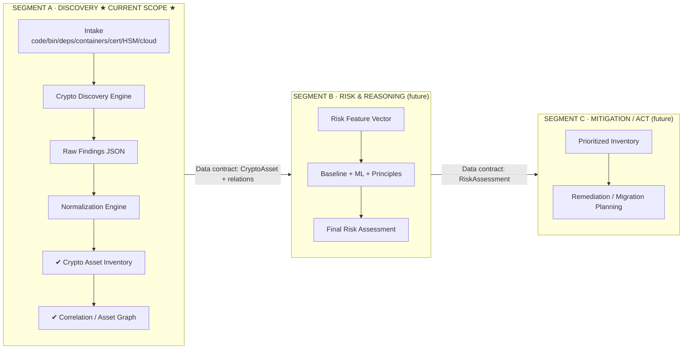

# ECDAT — Enterprise Cryptographic Discovery & Analysis Tool
## Modular Design & Dashboard Plan

**Repo:** `D:\General\SIH\ECDAT` · **Doc source:** `sih.svg` workflow · **Status:** Draft for review

---

## 1. Problem & Positioning

Enterprises cannot migrate or secure cryptography they cannot see. ECDAT automates **crypto discovery**, builds a **Cryptographic Bill of Materials (CBOM)**, risks-prioritizes every asset, and recommends migration — aligned with industry frameworks (NIST SP 1800-38, NIST IR 8547, CNSA 2.0, CADI/IETF).

**Core principle:** *You cannot migrate what you cannot find.* ECDAT turns every algorithm, key, certificate, and library into a discoverable, correlated, risk-scored asset.

---

## 2. Modular Architecture (3 independent segments)

ECDAT is split into **3 modular segments**, each an independently buildable/demoable unit connected by **defined data contracts**. This lets the team build and demo segments in isolation while keeping a clear final integration path.



| Segment | Responsibility | Input contract | Output contract | Status |
|---|---|---|---|---|
| **A · Discovery** | Find, normalize, inventory, correlate crypto assets | Source repos / binaries / deps / containers / certs / HSM / cloud | `CryptoAsset[]` + `AssetRelation[]` (+ CBOM, later sub-step) | **★ BUILDING NOW ★** |
| **B · Risk & Reasoning** | Score & explain risk per asset | `CryptoAsset[]` + relations | `RiskAssessment[]` | Future |
| **C · Mitigation / Act** | Prioritize & plan remediation | `RiskAssessment[]` | `Recommendation[]` + migration plan | Future |

**Segments depend only on the data contracts, not each other's code** → each can be developed, tested, and demoed independently.

---

## 3. Tech Stack (Balanced — industry standard, SIH-feasible)

### Backend
- **Django 4.2 LTS** — core web framework + ORM + admin
- **Django REST Framework (DRF)** — REST APIs for the dashboard
- **Celery + Redis** — async discovery/scan jobs (add once scans get long-running)
- **PostgreSQL** — primary store (SQLite for quick demo mode)

### Frontend (no heavy build step)
- **Django Templates** + **HTMX** — interactivity without a JS framework
- **Apache ECharts** — visualizations (network/force graph, sunburst, heatmap, sankey)
- **Bootstrap or Tailwind** — layout/UI
- **Chart.js** — lightweight fallback for simple KPI/line/bar charts

### Discovery / Analysis libraries (open source, called from Django)
- **Semgrep** (custom crypto rules) — source-code algorithm detection
- **cbomkit** (PQCA / open source) — CycloneDX CBOM generation (later sub-step)
- **Trivy / Syft / Grype** — SBOM + container image + dependency crypto inventory
- **Python `cryptography` + `OpenSSL` CLI** — X.509 cert & key parsing, algorithm/size detection
- **sslyze** — TLS cipher-suite / handshake identification (network)
- **scikit-learn** — ML risk-prioritization model (later, Segment B)
- **Pandas / NumPy** — feature engineering (later, Segment B)

### Storage / Formats
- **Django ORM relations** for the asset graph (edges table) — no extra DB needed
- **CycloneDX v1.6** CBOM (JSON/XML) + raw findings as **JSON / JSONL**

---

## 4. 🗺️ CURRENT SCOPE — Segment A: Discovery (detailed spec)

### 4.1 Sub-modules
1. **Intake layer** — adapters per source type: Source Code Repos, Binary Files, Libraries/Dependencies, Container Images, Certificates/PKI, HSM/Key Management, Cloud Crypto Services.
2. **Crypto Discovery Engine** — runs scanners per source; produces **Raw Findings** (JSON/JSONL).
   - Semgrep rules → source algo detection
   - Trivy/Syft → deps + container image crypto inventory
   - `cryptography` + OpenSSL → key-size / algorithm / X.509 cert parsing
   - sslyze → TLS cipher-suite detection (network)
   - **Demo Mode** → synthetic enterprise dataset for instant richness
3. **Normalization Engine** — dedupe, field-mapping, unknown-tagging, confidence scoring → **Normalized Findings**.
4. **Crypto Asset Classifier** — assign each finding to a canonical **CryptoAsset** (algorithm, key size, curve, protocol, library/version).
5. **Correlation Engine (graph)** — build `AssetRelation` edges (`contains` / `relate` / `context`) → **Crypto Asset Graph**.

### 4.2 Accepted current deliverables (Discovery only)
- Scanner intake + raw findings store
- Normalization pipeline + quality metrics
- Crypto asset inventory (canonical assets, searchable/filterable)
- Asset correlation graph
- **CBOM generation = deferred sub-step** (later within Segment A or moves to B)

---

## 5. 🖥️ DASHBOARD SYSTEM — separate spec (current scope)

The dashboard is a **deliverable in its own right**, planned as one cohesive UI shell with a full information architecture (7 screens). Only **Discovery-scoped screens are specced in detail** now; Risk & Mitigation screens are reserved placeholders.

*(Detailed: 5.1 UI Shell, 5.2 Screen IA, 5.3 Widget spec, 5.4 Widget→data mapping — see prior section. Interactive/UX/Auth/History decisions are captured separately as open questions to confirm before build.)*

---

## 6. Future segments (out of scope now — short stubs)

### Segment B — Risk & Reasoning (future)
- Feature Engineering → Risk Feature Vector; Baseline Risk Engine (deterministic rules + score); ML Risk Prioritization (`scikit-learn`); Risk Fusion Engine → Final Risk Assessment; Explainability Engine → Explainable Risk Report.
- **Dashboard additions (placeholder screen E)**: feature-vector panel, principles view, baseline vs ML comparison, risk-fusion waterfall, quantum/HNDL/Mosca detail, explainability panel.

### Segment C — Mitigation / Act (future)
- Prioritized crypto inventory; remediation planner (hybrid key exchange, target algo ML-KEM/ML-DSA); migration wave planning (CNSA 2.0 / G7); compliance mapping.
- **Dashboard additions (placeholder screen F)**: prioritized inventory table, remediation planner, migration-wave plan, compliance mapping + audit export.

---

## 7. Proposed Django Data Model (Discovery-scoped now)
- `ScanJob` (scanner, target, status, progress, started/finished)
- `RawFinding` (source_type, raw_json, ingested_at, status)
- `NormalizedFinding` (fk RawFinding, algorithm, key_size, curve, protocol, confidence)
- `CryptoAsset` (normalized fields, classification, confidence, enrichment)
- `AssetRelation` (from_asset, to_asset, relation_type: contains/relate/context)
- *(Reserved for later:* `CBOMComponent`, `RiskAssessment`, `BusinessContext`*)*

---

## 8. Sprint Plan (Discovery + Dashboard only)

1. **Foundation** — Django project, models, UI shell + sidebar/nav, demo-mode seed data.
2. **Discovery engine** — wire Semgrep / Trivy / Syft / OpenSSL → RawFinding; normalization + classifier; build Screen C fully.
3. **Correlation graph** — `AssetRelation` graph + Crypto Asset Graph widget (ECharts).
4. **Dashboard completion** — Overview, Understanding, Reports, CBOM viewer stub.
5. **Polish & demo** — search/filter UX, demo dataset, docs, presentation.

---

## 9. Dashboard Decisions (LOCKED for build)

| Topic | Decision |
|---|---|
| **Authentication** | **No auth** — dashboard opens straight in on localhost (SIH demo). No login/user screens in current scope. |
| **Roles / permissions** | **Single admin** — everyone has full access (run scans, manage assets, export). |
| **History / audit** | **Scan history + audit log** — track past `ScanJobs` (timestamps, status, result counts) + a simple `AuditLog` of key actions (scan run, findings ingested, exports, asset merges/deletes). |
| **Visual style** | **Light enterprise theme** — clean Bootstrap-style admin look, card grid, readable light background. |
| **Layout** | **Sidebar + topbar** — fixed left sidebar nav (screens), top bar (global search, "Run Discovery", environment). Content area as responsive card grid. |
| **Interactivity** | **HTMX + DRF + ECharts** — HTMX for inline table sort/filter/pagination + partial refreshes; ECharts renders charts from DRF JSON endpoints. |

*Scan history + audit log are built into the UI shell (current scope).*

---

## 10. Django Project / Module Structure

Planned app split (one Django project `ecdat`, multiple apps):

```
ECDAT/
├── manage.py
├── requirements.txt
├── .env.example
├── config/                    # Django project settings (project-level)
│   ├── settings.py
│   ├── urls.py
│   ├── asgi.py / wsgi.py
├── core/                      # shared: base models, audit logging, utilities
│   ├── models.py              # AuditLog, TimeStampedModel base
│   ├── audit.py               # audit-log helper mixin
├── discovery/                 # SEGMENT A — the current build
│   ├── models.py              # ScanJob, RawFinding, NormalizedFinding,
│   │                          #   CryptoAsset, AssetRelation
│   ├── scanners/              # intake adapters per source type
│   │   ├── base.py            # Scanner base class/interface
│   │   ├── source_code.py     # Semgrep-based code scanner
│   │   ├── binaries.py
│   │   ├── dependencies.py    # Trivy/Syft
│   │   ├── containers.py
│   │   ├── certificates.py    # cryptography + OpenSSL
│   │   ├── hsm.py
│   │   └── cloud.py
│   ├── normalizer.py          # normalization engine
│   ├── classifier.py          # crypto asset classifier
│   ├── correlation.py         # AssetRelation / graph builder
│   ├── services.py            # orchestration (run scan → ingest → normalize → classify → correlate)
│   ├── api.py                 # DRF endpoints (findings, assets, relations, scanjobs)
│   ├── urls.py
├── dashboard/                 # UI shell + pages (current scope)
│   ├── views.py / urls.py     # server-rendered pages + HTMX partials
│   ├── templates/dashboard/
│   └── static/dashboard/      # CSS, JS (ECharts, HTMX)
├── reports/                   # exports (CSV/JSON) — current scope
└── fixtures/                  # demo-mode synthetic seed data
```

**App responsibilities:**
- `config` — settings, root URLs.
- `core` — shared base models + `AuditLog`; every mutating action writes an audit entry.
- `discovery` — **Segment A**: scanners, normalization, classification, correlation, own models + DRF API.
- `dashboard` — server-rendered pages (HTMX partials) + ECharts widgets consuming `discovery/api`.
- `reports` — CSV/JSON exports of findings/assets.

**Dependency rule:** `dashboard` may call `discovery.services`/`api` but not the reverse. Future segments (`risk`, `mitigation`) plug in after `discovery` without touching it.

---

## 11. Open Decisions (for next working session)
1. Which source type(s) to scan **first** for the real demo (recommend Source Code Repos + a Container).
2. Whether to include demo-mode synthetic data now (recommended: yes) alongside real scanning.
3. Confirm CBOM generation is deferred to after the Discovery core is demo-ready.
