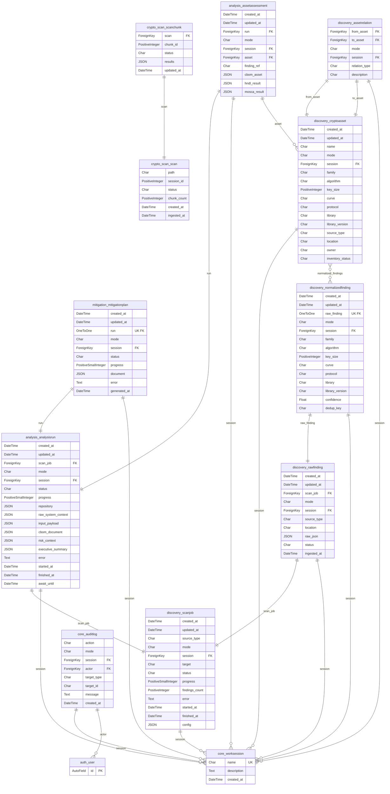

# ECDAT schema (Mermaid ERD)

> AUTO-GENERATED by `scripts/generate_schema_docs.py` — do not edit; regenerate.

Render this file on GitHub (Mermaid) or paste into https://mermaid.live.

```mermaid
erDiagram
    mitigation_mitigationplan {
        DateTime created_at
        DateTime updated_at
        OneToOne run "UK FK"
        Char mode
        ForeignKey session "FK"
        Char status
        PositiveSmallInteger progress
        JSON document
        Text error
        DateTime generated_at
    }

    analysis_analysisrun {
        DateTime created_at
        DateTime updated_at
        ForeignKey scan_job "FK"
        Char mode
        ForeignKey session "FK"
        Char status
        PositiveSmallInteger progress
        JSON repository
        JSON raw_system_context
        JSON input_payload
        JSON cbom_document
        JSON risk_context
        JSON executive_summary
        Text error
        DateTime started_at
        DateTime finished_at
        DateTime await_until
    }

    analysis_assetassessment {
        DateTime created_at
        DateTime updated_at
        ForeignKey run "FK"
        Char mode
        ForeignKey session "FK"
        ForeignKey asset "FK"
        Char finding_ref
        JSON cbom_asset
        JSON hndl_result
        JSON mosca_result
    }

    crypto_scan_scan {
        Char path
        PositiveInteger session_id
        Char status
        PositiveInteger chunk_count
        DateTime created_at
        DateTime ingested_at
    }

    crypto_scan_scanchunk {
        ForeignKey scan "FK"
        PositiveInteger chunk_id
        Char status
        JSON results
        DateTime updated_at
    }

    discovery_assetrelation {
        ForeignKey from_asset "FK"
        ForeignKey to_asset "FK"
        Char mode
        ForeignKey session "FK"
        Char relation_type
        Char description
    }

    discovery_cryptoasset {
        DateTime created_at
        DateTime updated_at
        Char name
        Char mode
        ForeignKey session "FK"
        Char family
        Char algorithm
        PositiveInteger key_size
        Char curve
        Char protocol
        Char library
        Char library_version
        Char source_type
        Char location
        Char owner
        Char inventory_status
    }

    discovery_normalizedfinding {
        DateTime created_at
        DateTime updated_at
        OneToOne raw_finding "UK FK"
        Char mode
        ForeignKey session "FK"
        Char family
        Char algorithm
        PositiveInteger key_size
        Char curve
        Char protocol
        Char library
        Char library_version
        Float confidence
        Char dedup_key
    }

    discovery_rawfinding {
        DateTime created_at
        DateTime updated_at
        ForeignKey scan_job "FK"
        Char mode
        ForeignKey session "FK"
        Char source_type
        Char location
        JSON raw_json
        Char status
        DateTime ingested_at
    }

    discovery_scanjob {
        DateTime created_at
        DateTime updated_at
        Char source_type
        Char mode
        ForeignKey session "FK"
        Char target
        Char status
        PositiveSmallInteger progress
        PositiveInteger findings_count
        Text error
        DateTime started_at
        DateTime finished_at
        JSON config
    }

    core_auditlog {
        Char action
        Char mode
        ForeignKey session "FK"
        ForeignKey actor "FK"
        Char target_type
        Char target_id
        Text message
        DateTime created_at
    }

    core_worksession {
        Char name "UK"
        Text description
        DateTime created_at
    }

    auth_user {
        AutoField id "PK"
    }

    mitigation_mitigationplan ||--|| analysis_analysisrun : "run"
    mitigation_mitigationplan ||--o{ core_worksession : "session"
    analysis_analysisrun ||--|| discovery_scanjob : "scan_job"
    analysis_analysisrun ||--o{ core_worksession : "session"
    analysis_assetassessment ||--|| analysis_analysisrun : "run"
    analysis_assetassessment ||--o{ core_worksession : "session"
    analysis_assetassessment ||--o{ discovery_cryptoasset : "asset"
    crypto_scan_scanchunk ||--|| crypto_scan_scan : "scan"
    discovery_assetrelation ||--|| discovery_cryptoasset : "from_asset"
    discovery_assetrelation ||--|| discovery_cryptoasset : "to_asset"
    discovery_assetrelation ||--o{ core_worksession : "session"
    discovery_cryptoasset ||--o{ core_worksession : "session"
    discovery_cryptoasset }o--o{ discovery_normalizedfinding : "normalized_findings"
    discovery_normalizedfinding ||--|| discovery_rawfinding : "raw_finding"
    discovery_normalizedfinding ||--o{ core_worksession : "session"
    discovery_rawfinding ||--|| discovery_scanjob : "scan_job"
    discovery_rawfinding ||--o{ core_worksession : "session"
    discovery_scanjob ||--o{ core_worksession : "session"
    core_auditlog ||--o{ core_worksession : "session"
    core_auditlog ||--o{ auth_user : "actor"
```
